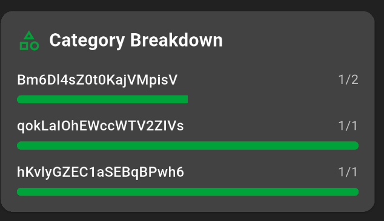

December 10, 2025 | 10:45 PM

So when building a query for the new list insights feature in ShopSync, I kinda messed something up and it resulted in the item category IDs showing up rather than the item category names showing up.

Other than that, the insights feature is coming up really good so far, I just have a few issues with the insights for users as indexing all the user's list is really tough for some reason.

UPDATE 1 -- December 10, 2025 | 10:55 PM

I've fixed the issue! The list/user insights feature is done and I'll create a PR and sleep.
